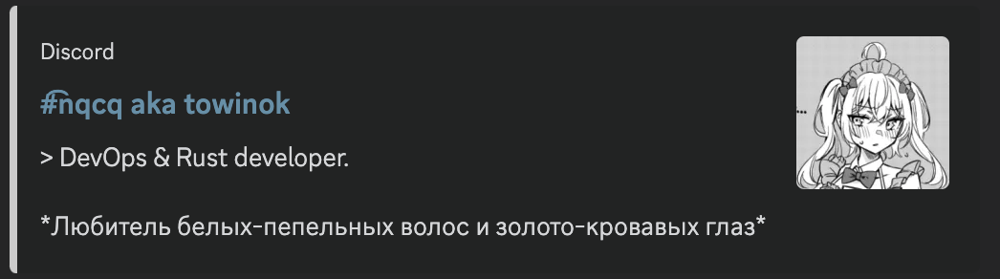
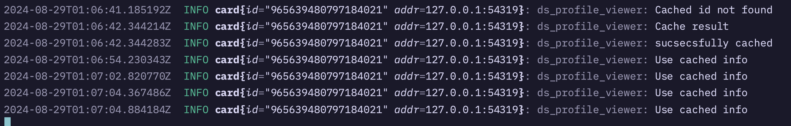

# Discord OpenGraph Viewer
This api provide you blazing fast card/link generator with opengraph ingection for sharing your cool discord account

**Note** before starting setup envs.

# Features
- tracing
- cache for 1 hour
- no display only one name if custom name and name is same

# Example
- profile
  
- tracing
  

# How to use
- install
  1. Manual.
    - clone repo
    - cd repo-name
    - cargo build --release
    - ./target/release/ds_profile_viewer
  2. Use docker
    - in progress
  3. use docker-compose
    - in progress
  4. download release tag
    - in progress
- usage
  http://your-cool-ip:port/id/{id}
  if you using revers proxy, you know it...

# FAQ
1. Where can I find id?
  - Go to settings (discord)
  - Open Advanced
  - Enable Developer Mode
  - Click on any user
  - 3 dots (**for yourself** click on user profle. close to settings button.)
  - copy user id
2. Where can I find token?
  - Go to browser
  - Login to discord at discord web app
  - Go to Dev Tools
  - open network
  - click at all
  - check any packet with Authorization header
  - copy this header
  - paste in .env in Token field
